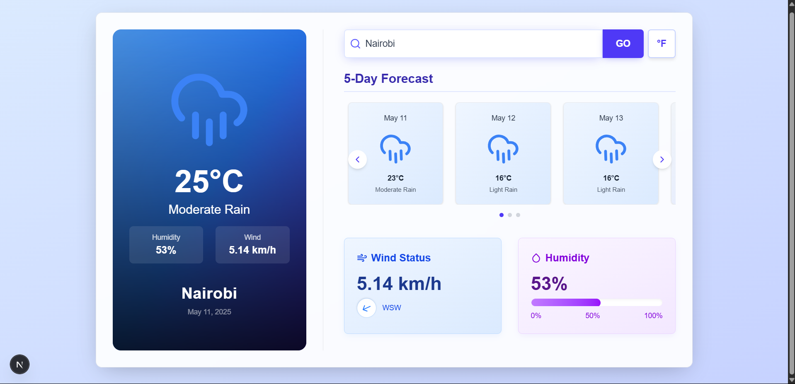
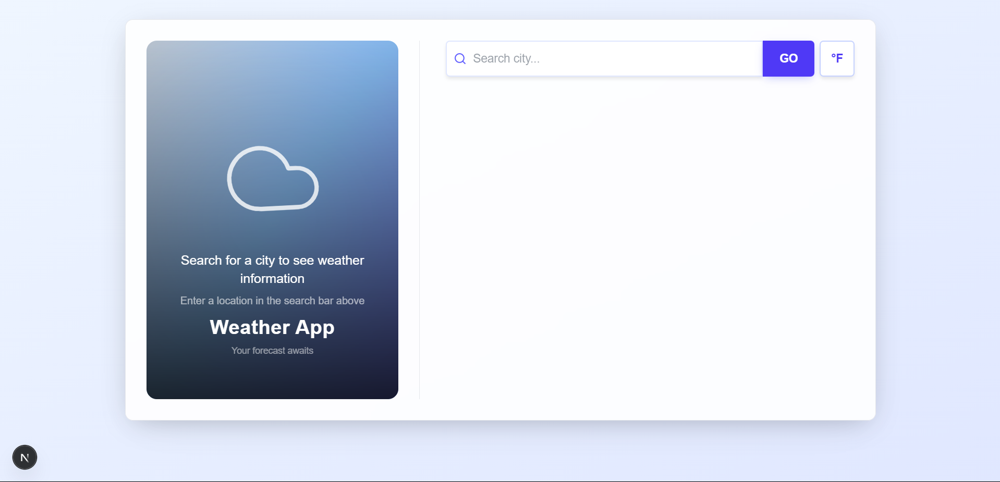

# Weather App

A modern, responsive weather application with real-time weather data, forecasts, and beautiful UI effects.



## Features

- **Real-time Weather Data**: Get current weather information for any city worldwide
- **5-Day Forecast**: View weather predictions for the next 5 days
- **Dynamic UI**: Background and colors adapt based on current weather conditions
- **Animated Elements**: Smooth animations and transitions for an engaging user experience
- **Responsive Design**: Works seamlessly on mobile, tablet, and desktop devices
- **Unit Toggle**: Switch between Celsius and Fahrenheit temperature units
- **Detailed Weather Info**: Wind speed, humidity, and other important weather metrics

## Technologies Used

### Frontend

- **React 19**: Modern UI library for building the user interface
- **Next.js 15**: React framework for server-side rendering and static site generation
- **TypeScript**: Type-safe JavaScript for better development experience
- **Tailwind CSS 4**: Utility-first CSS framework for styling
- **Framer Motion**: Animation library for smooth transitions and effects
- **RippleUI**: UI component library for enhanced design
- **Lucide React**: Icon library for clean, consistent iconography
- **React Hot Toast**: Toast notification library for user feedback

### Backend

- **PHP 8.2**: Server-side scripting language
- **Laravel 12**: PHP web application framework
- **OpenWeatherMap API**: External API for weather data

## Getting Started

### Prerequisites

- Node.js (v18.18.0 or higher) for frontend
- PHP 8.2 or higher for backend
- Composer (PHP package manager)
- npm or yarn

### Installation

1. Clone the repository

```bash
git clone https://github.com/daviesevan/assessment.git
cd assessment
```

2. Install dependencies for both frontend and backend

```bash
# Install frontend dependencies
cd frontend
npm install
# or
yarn install

# Install backend dependencies
cd ../backend
composer install
```

3. Set up environment variables

   - Create a `.env` file in the backend directory by copying the example file

   ```bash
   cd backend
   cp .env.example .env
   ```

   - Generate Laravel application key

   ```bash
   php artisan key:generate
   ```

   - Add your OpenWeatherMap API key to the `.env` file:

   ```
   OPENWEATHERMAP_API_KEY=your_api_key_here
   ```

4. Start the development servers

```bash
# Start backend server (from backend directory)
php artisan serve
# This will start the server at http://localhost:8000

# Start frontend server (from frontend directory)
cd ../frontend
npm run dev
# or
yarn dev
```

5. Open your browser and navigate to `http://localhost:3000`

## Usage



1. **Search for a City**: Enter a city name in the search bar and click "GO"
2. **View Current Weather**: See the current temperature, weather condition, and other details
3. **Check Forecast**: Scroll through the 5-day forecast using the navigation arrows
4. **Toggle Temperature Unit**: Click the °C/°F button to switch between Celsius and Fahrenheit

## Project Structure

```
weather-app/
├── frontend/               # Frontend React application
│   ├── public/             # Static files
│   ├── src/                # Source files
│   │   ├── app/            # Next.js app directory
│   │   ├── components/     # React components
│   │   ├── services/       # API service functions
│   │   └── types/          # TypeScript type definitions
│   ├── package.json        # Frontend dependencies
│   └── tsconfig.json       # TypeScript configuration
├── backend/                # Backend Laravel application
│   ├── app/                # Application code
│   │   ├── Http/           # HTTP layer
│   │   │   ├── Controllers/# Request handlers
│   │   │   └── Middleware/ # HTTP middleware
│   │   ├── Providers/      # Service providers
│   │   └── Services/       # Business logic
│   ├── routes/             # API and web routes
│   ├── config/             # Configuration files
│   ├── resources/          # Views and assets
│   ├── composer.json       # PHP dependencies
│   └── artisan             # Laravel command-line tool
├── assets/                 # Documentation assets
└── README.md               # Project documentation
```

## UI Features

### Dynamic Weather Backgrounds

The app features dynamic backgrounds that change based on the current weather conditions:

- Clear/Sunny: Warm amber to orange gradient
- Cloudy: Slate to indigo gradient
- Rainy: Blue to indigo gradient
- Snowy: Light blue to indigo gradient

### Animated Elements

- Floating weather icons
- Kinetic gradient backgrounds
- Smooth transitions between states
- Interactive hover effects

### Visual Hierarchy

- Netflix-style card design with gradient overlays
- Clear typography with proper visual weight
- Prominent display of important information
- Intuitive layout and navigation

## API Endpoints

The backend provides the following API endpoints:

- `GET /api/weather/current?city={cityName}` - Get current weather for a specific city
- `GET /api/weather/forecast?city={cityName}` - Get 5-day forecast for a specific city

## Future Enhancements

- User accounts and saved locations
- Weather alerts and notifications
- Historical weather data
- More detailed weather information
- Dark/Light theme toggle
- Geolocation support

## Contributing

Contributions are welcome! Please feel free to submit a Pull Request.

1. Fork the repository
2. Create your feature branch (`git checkout -b feature/amazing-feature`)
3. Commit your changes (`git commit -m 'Add some amazing feature'`)
4. Push to the branch (`git push origin feature/amazing-feature`)
5. Open a Pull Request

## License

This project is licensed under the MIT License - see the LICENSE file for details.

## Acknowledgments

- [OpenWeatherMap](https://openweathermap.org/) for providing the weather data API
- [Laravel](https://laravel.com/) for the PHP framework
- [Tailwind CSS](https://tailwindcss.com/) for the utility-first CSS framework
- [Framer Motion](https://www.framer.com/motion/) for the animation library
- [Next.js](https://nextjs.org/) for the React framework
- [RippleUI](https://www.ripple-ui.com/) for UI components

## Author

**Evan Davies** - [daviesevan](https://github.com/daviesevan)
